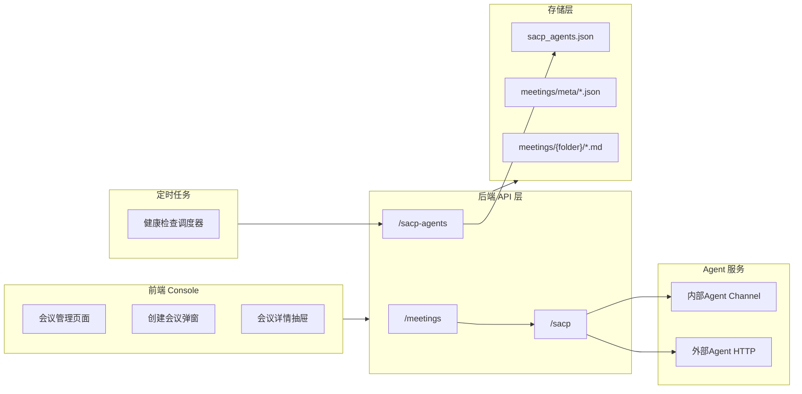
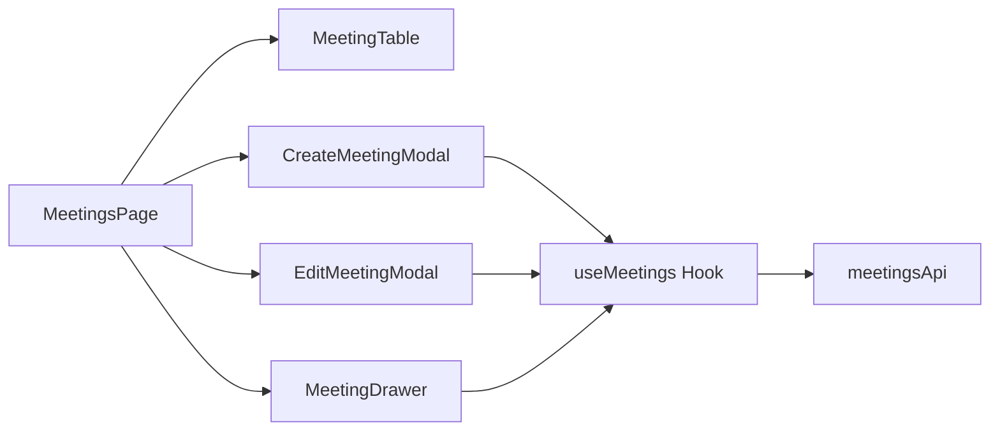

# CoPaw 多 Agent 会议系统 - 设计文档

## 文档信息

| 项目     | 内容                |
| -------- | ------------------- |
| 版本号   | v0.4.0              |
| 创建日期 | 2026-03-21          |
| 更新日期 | 2026-04-01          |
| 状态     | 已实现              |

---

## 一、概述

### 1.1 背景

CoPaw 会议系统支持多 Agent 协作，通过 **SACP (Simple Agent Communication Protocol)** 协议实现会议流程自动化。

**核心问题**：

1. 智能体协作时需同人类进行各种临时会议或者例行会议，以便对其目标，相互发言，形成共识
2. 智能体会议需对人类可见，会议目标、会议记录、会议纪要；为保证智能体开好会，需要展示思考过程
3. 智能体会议时，需要由主持智能体根据发言轮次触发对应汇报智能体发言，最后由决策智能体汇总意见并决策
4. 智能体沟通是双向的、简单的: add sacp-api (Simple Agent Communication Protocol)
  - req(messages)->rsp(content,reasons)
  - messages-api is oneway muti-agent api

### 1.2 设计目标

1. **配置集中化**：统一管理内外部 SACP Agent 配置
2. **配置复用**：一次配置，多次使用
3. **健康监控**：实时掌握 Agent 可用性
4. **简化操作**：CoPaw 自管理 Agent 一键选择
5. **模块独立性**：新增 `meetings` 模块与现有 CoPaw 代码解耦
6. **Agent 复用**：基于 `channel` 机制封装，复用现有实现
7. **四文档输出**：会议目标(goals) + 发言记录(records) + 会议纪要(summary) + 推理过程(reasons)
8. **多轮发言**：多轮发言，比如：第二轮顺序反转，确保充分讨论；第三轮，字母顺序发言、随机发言

---

## 二、前端页面 UI Mockup

### 2.1 会议管理页面

```
┌──────────────────────────────────────────────────────────────────┐
│ 会议管理                                               [+ 创建会议] │
├──────────────────────────────────────────────────────────────────┤
│ 会议名称     │ 类型       │ 状态     │ 主持人  │ 操作            │
├──────────────────────────────────────────────────────────────────┤
│ Q1技术评审   │ TEMPORARY  │ COMPLETED│ 张工    │ [查看][编辑][删除]│
│ 周例会       │ REGULAR    │ CREATED  │ 李工    │ [启动][编辑][删除]│
└──────────────────────────────────────────────────────────────────┘
```

### 2.2 创建会议弹窗

```
┌─────────────────────────────────────────────────────────────┐
│ 创建会议                                            [×]     │
├─────────────────────────────────────────────────────────────┤
│ 会议名称: [Q1技术方案评审会________________]               │
│ 会议类型: (●) 临时会议  ( ) 例会                          │
│                                                             │
│ 议题                                                        │
│ ├─ 标题: [技术方案评审__________________]                 │
│ ├─ 描述: [评审新系统架构设计方案________]                  │
│ └─ 背景: [当前系统已运行5年...]                           │
│                                                             │
│ 参与者: [选择Agent ▼]                          [+ 添加]        │
│ ┌───────────────────────────────────────────────────────┐  │
│ │ 名称     │ Agent   │ 角色        │ 操作              │  │
│ ├──────────┼─────────┼─────────────┼──────────────────┤  │
│ │ 张工     │ Alpha ● │ HOST,DECIDER│ [删除]           │  │
│ │ 架构师A  │ Beta  ● │ REPORTER    │ [删除]           │  │
│ └───────────────────────────────────────────────────────┘  │
│                                                             │
│ 发言轮次: [raw, reverse ▼]                                 │
│                                                             │
│                    [取消]  [创建会议]                        │
└─────────────────────────────────────────────────────────────┘
```

### 2.3 会议详情抽屉

```
┌─────────────────────────────────────────────────────────────┐
│ 会议详情                                            [×]     │
├─────────────────────────────────────────────────────────────┤
│ Q1技术方案评审会                          [启动] [停止]      │
│ ────────────────────────────────────────────────────────── │
│                                                             │
│ 基本信息                                                    │
│ ├─ 会议ID: A1B2C3D4                                       │
│ ├─ 会议类型: TEMPORARY                                    │
│ ├─ 状态: RUNNING                                         │
│ └─ 当前阶段: ROUND #2                                     │
│                                                             │
│ 议题                                                        │
│ ├─ 标题: 技术方案评审                                     │
│ ├─ 描述: 评审新系统架构设计方案                           │
│ └─ 背景: 当前系统已运行5年...                             │
│                                                             │
│ 文档                                                        │
│ ├─ [查看goals]  [查看records]  [查看summary]              │
│ └─ [查看reasons]                                          │
└─────────────────────────────────────────────────────────────┘
```

---

## 三、系统架构

### 3.1 架构图

**整体架构**：


**前端组件结构**：


### 3.2 SACP 通信流程

1. **MeetingManager** 通过 `SACPClient.chat()` 发送 HTTP 请求到 `/sacp/chat`
2. **SACP Router** 根据 Agent 配置判断类型：
   - **内部 Agent**：`is_internal=True` → `_call_internal_agent()`
     - 通过 `channel_manager.get_channel("sacp")` 获取 channel
     - `channel.new_reply(session_id)` 创建回复回调
     - `channel.consume_one(native_payload)` 消费消息
     - `channel.wait_reply(session_id)` 异步等待响应
   - **外部 Agent**：直接 HTTP POST 到配置的 URL
3. Agent 响应返回后写入 `records.md`

**SACP 通信协议**：HTTP JSON-RPC 2.0，内部 Agent 通过 Channel 回调模式，外部 Agent 通过 HTTP POST。

### 3.3 模块结构

```
src/copaw/
├── meetings/                          # 会议模块
│   ├── manager.py                    # MeetingManager (核心)
│   ├── rpc.py                        # SACP Client
│   ├── storage.py                    # MeetingStorage
│   └── models/                       # 数据模型
│       ├── types.py                  # 枚举类型
│       ├── config.py                 # MeetingConfig
│       └── ...
│
├── app/routers/
│   ├── sacp.py                       # SACP 通信接口
│   ├── sacp_agents.py               # SACP Agent 配置
│   └── meetings.py                   # 会议管理接口
│
└── console/src/pages/Control/Meetings/ # 前端组件
```

---

## 四、安全性设计

### 4.1 发言可见性

Agent 通过消息模板嵌入文档路径，自行读取历史发言内容。

### 4.2 安全检测

在 `channel.consume_one()` 中进行安全检测：

| 检测类型     | 模式示例                       | 处理方式 |
| ------------ | ------------------------------ | -------- |
| **金钱相关** | 转账、汇款、比特币、理财       | 软性拒绝 |
| **密钥相关** | 密码、API key、token、证书     | 软性拒绝 |
| **权限变更** | sudo、改主人、提权、root       | 软性拒绝 |
| **自我修改** | 自我复制、注入代码、hook       | 软性拒绝 |
| **自述文件** | AGENTS.md、SOUL.md、PROFILE.md | 软性拒绝 |

**软性拒绝**：返回警告消息 `"[SACP 安全拒绝] 检测到可疑内容"` 而非执行。

---

## 五、版本历史

| 版本   | 日期       | 修改内容                                             |
| ------ | ---------- | ---------------------------------------------------- |
| v0.4.0 | 2026-04-01 | 重构文档：简化架构图、精简重复内容                   |
| v0.3.1 | 2026-03-30 | 新增 reasons 推理过程、PhaseType、完整 API 端点     |
| v0.3.0 | 2026-03-27 | 更新 Roadmap 完成状态                               |
| v0.2.0 | 2026-03-26 | 重组文档结构                                         |
| v0.1.0 | 2026-03-24 | 增加 SACP Agent 配置管理功能                         |
| v0.0.0 | 2026-03-21 | 初始设计                                             |

---

## 六、命名说明

> ⚠️ 当前实现命名为 **SACP (Simple Agent Communication Protocol)**，避免与标准 SACP/ACP/MCP/ANP 协议命名冲突。

| 协议 | 提出方 | 用途 |
|------|--------|------|
| MCP | Anthropic | LLM 上下文标准化 |
| A2A | Google | 多 Agent 协作 |
| ACP | BeeAI+IBM | 开放智能体通信 |
| SACP | CoPaw | CoPaw 内部多 Agent 协作 |

**设计原则**：简单、低依赖、跨网络。不追求完整协议栈，专注实用功能。

---

_文档结束_
