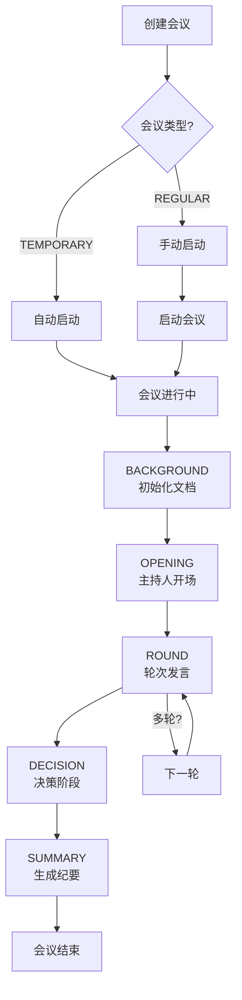

# CoPaw 会议系统 (Meeting Module)

> 多 Agent 会议协作系统，支持多 Agent 发言、决策和文档生成。

---

## 目录

- [快速开始](#快速开始)
- [功能特性](#功能特性)
- [会议流程](#会议流程)
- [API 参考](#api-参考)
- [数据存储](#数据存储)
- [前端使用](#前端使用)
- [常见问题](#常见问题)
- [相关文档](#相关文档)

---

## 快速开始

### 1. 创建临时会议（自动启动）

```bash
curl -X POST http://localhost:8089/meetings \
  -H "Content-Type: application/json" \
  -d '{
    "meeting_name": "技术方案评审会",
    "meeting_type": "TEMPORARY",
    "topic": {
      "title": "微服务架构方案评审",
      "description": "评审新系统架构设计方案",
      "context": "当前系统已运行5年，需要升级改造以支持更大规模用户。"
    },
    "participants": [
      {"id": "host_001", "name": "张工", "roles": ["HOST"], "intent": "主持会议，引导讨论"},
      {"id": "reporter_001", "name": "架构师A", "roles": ["REPORTER"], "intent": "介绍微服务架构方案"}
    ],
    "host_id": "host_001",
    "decider_id": "host_001",
    "rounds": ["raw", "reverse"]
  }'
```

### 2. 创建例会（需手动启动）

```bash
# 创建例会
curl -X POST http://localhost:8089/meetings \
  -H "Content-Type: application/json" \
  -d '{
    "meeting_name": "周例会",
    "meeting_type": "REGULAR",
    "topic": {"title": "本周工作总结"},
    "participants": [...],
    "host_id": "host_001",
    "decider_id": "host_001",
    "rounds": ["raw"]
  }'

# 手动启动
curl -X POST http://localhost:8089/meetings/{meeting_id}/start
```

### 3. 查看会议结果

```bash
# 查看会议列表
curl http://localhost:8089/meetings

# 查看会议详情
curl http://localhost:8089/meetings/{meeting_id}

# 查看会议目标
curl http://localhost:8089/meetings/{meeting_id}/goals

# 查看发言记录
curl http://localhost:8089/meetings/{meeting_id}/records

# 查看会议纪要
curl http://localhost:8089/meetings/{meeting_id}/summary

# 查看推理过程
curl http://localhost:8089/meetings/{meeting_id}/reasons
```

---

## 功能特性

### 会议类型

| 类型 | 说明 | 自动启动 |
|------|------|----------|
| `TEMPORARY` | 临时会议，一次性讨论 | ✅ 创建后自动启动 |
| `REGULAR` | 例会，周期性会议 | ❌ 需手动启动 |

### 会议状态

| 状态 | 说明 |
|------|------|
| `CREATED` | 已创建 |
| `INITIALIZED` | 已初始化 |
| `RUNNING` | 进行中 |
| `COMPLETED` | 已完成 |
| `STOPPED` | 已停止 |
| `FAILED` | 失败 |

### 会议阶段

```
BACKGROUND → OPENING → ROUND → DECISION → SUMMARY
```

| 阶段 | 说明 |
|------|------|
| `BACKGROUND` | 会前准备，初始化文档 |
| `OPENING` | 开场，主持人开场白 |
| `ROUND` | 轮次发言，汇报人轮流发言 |
| `DECISION` | 决策，决策人综合发言 |
| `SUMMARY` | 总结，生成会议纪要 |

### 角色类型

| 角色 | 说明 | 发言阶段 |
|------|------|----------|
| `HOST` | 主持人，负责开场和总结 | OPENING, SUMMARY |
| `REPORTER` | 汇报人，轮流发言 | ROUND |
| `DECIDER` | 决策人，最终决策 | DECISION |

### 发言顺序模式

| 模式 | 说明 |
|------|------|
| `raw` | 正序发言 (A → B → C) |
| `reverse` | 反序发言 (C → B → A) |
| `alphabet` | 按字母顺序 |
| `random` | 随机顺序 |

---

## 会议流程

### 完整流程



---

## API 参考

### 会议管理接口

| 方法 | 路径 | 说明 |
|------|------|------|
| `POST` | `/meetings` | 创建会议 |
| `GET` | `/meetings` | 会议列表查询（分页） |
| `GET` | `/meetings/{id}` | 会议详情查询 |
| `PATCH` | `/meetings/{id}` | 更新会议 |
| `DELETE` | `/meetings/{id}` | 删除会议 |
| `POST` | `/meetings/{id}/start` | 启动会议 |
| `POST` | `/meetings/{id}/stop` | 停止会议 |
| `POST` | `/meetings/{id}/restart` | 重启会议 |
| `GET` | `/meetings/{id}/status` | 会议状态查询 |
| `GET` | `/meetings/{id}/goals` | 获取会议目标 |
| `GET` | `/meetings/{id}/records` | 获取发言记录 |
| `GET` | `/meetings/{id}/summary` | 获取会议纪要 |
| `GET` | `/meetings/{id}/reasons` | 获取推理过程 |

### SACP Agent 配置接口

| 方法 | 路径 | 说明 |
|------|------|------|
| `GET` | `/sacp-agents` | 列表所有配置 |
| `POST` | `/sacp-agents` | 创建配置 |
| `GET` | `/sacp-agents/settings` | 获取全局设置 |
| `PUT` | `/sacp-agents/settings` | 更新全局设置 |
| `GET` | `/sacp-agents/entity/{id}` | 获取详情 |
| `PUT` | `/sacp-agents/entity/{id}` | 更新配置 |
| `DELETE` | `/sacp-agents/entity/{id}` | 删除配置 |
| `POST` | `/sacp-agents/health_check` | 批量健康检查 |
| `POST` | `/sacp-agents/health_check/{id}` | 单个健康检查 |

### SACP 通信接口

| 方法 | 路径 | 说明 |
|------|------|------|
| `POST` | `/sacp/chat` | SACP 聊天（流式响应） |
| `GET` | `/sacp/health` | 健康检查 |

---

## 数据存储

### 目录结构

```
WORKING_DIR/
└── meetings/
    ├── index.md                 # 全局索引
    ├── meta/
    │   └── {meeting_id}.json   # 会议配置 (每个会议一个JSON)
    │
    ├── r_A1B2C3D4_技术评审/   # 例会文件夹(r = regular)
    │   ├── yyMMdd_HHmm_goals.md       # 会议目标
    │   ├── yyMMdd_HHmm_records.md     # 发言记录
    │   ├── yyMMdd_HHmm_summary.md     # 会议纪要
    │   └── yyMMdd_HHmm_reasons.json   # 推理过程
    │
    └── t_E5F6G7H8_产品讨论/   # 临时会议文件夹(t = temporary)
        ├── yyMMdd_HHmm_goals.md
        ├── yyMMdd_HHmm_records.md
        ├── yyMMdd_HHmm_summary.md
        └── yyMMdd_HHmm_reasons.json
```

### 四份文档

| 文档 | 说明 | 格式 |
|------|------|------|
| `goals.md` | 会议目标/议程 | Markdown |
| `records.md` | 发言记录 | Markdown |
| `summary.md` | 会议纪要 | Markdown |
| `reasons.json` | 推理过程 (Chain of Thought) | JSON |

---

## 前端使用

### 组件结构

```
console/src/pages/Control/Meetings/
├── index.tsx                    # 主页面组件
├── useMeetings.ts               # 状态管理 Hook
└── components/
    ├── MeetingTable.tsx         # 会议列表表格
    ├── MeetingDrawer.tsx        # 会议详情抽屉
    ├── CreateMeetingModal.tsx   # 创建会议弹窗
    └── EditMeetingModal.tsx     # 编辑会议弹窗
```

### 主要功能

| 功能 | 组件 | 说明 |
|------|------|------|
| 会议列表 | `MeetingTable` | 展示所有会议，支持状态筛选 |
| 创建会议 | `CreateMeetingModal` | 两步式创建表单 |
| 编辑会议 | `EditMeetingModal` | 编辑会议基本信息 |
| 会议详情 | `MeetingDrawer` | 查看详情、文档、操作会议 |
| 状态管理 | `useMeetings` | 数据获取和操作封装 |

### 状态标签颜色

| 状态 | 颜色 |
|------|------|
| `CREATED` | 默认灰色 |
| `INITIALIZED` | 蓝色 |
| `RUNNING` | 蓝色（处理中） |
| `COMPLETED` | 绿色（成功） |
| `STOPPED` | 橙色（警告） |
| `FAILED` | 红色（错误） |

---

## 常见问题

### Q: 例会创建后不启动怎么办？

例会创建后状态为 `CREATED`，需要手动启动：

- **UI 方式**：在 Meetings 页面点击会议的「启动」按钮
- **API 方式**：`POST /meetings/{meeting_id}/start`

### Q: 会议文档在哪里查看？

1. **文件系统**：`WORKING_DIR/meetings/{folder}/`
2. **前端界面**：Meetings 页面的详情抽屉
3. **API 调用**：`GET /meetings/{id}/goals|records|summary|reasons`

### Q: 临时会议和例会有什么区别？

| 区别 | TEMPORARY | REGULAR |
|------|-----------|---------|
| 自动启动 | ✅ | ❌ |
| 适用场景 | 一次性讨论 | 周期性例会 |

### Q: 如何查看 Agent 的思考过程？

```bash
curl http://localhost:8089/meetings/{meeting_id}/reasons
```

### Q: 会议运行中能编辑吗？

会议状态为 `RUNNING` 或 `INITIALIZED` 时，除状态更新外，其他配置不可编辑。

---

## SACP 命名说明

> SACP = Simple Agent Communication Protocol
> 这是 CoPaw 私有实现的简化 Agent 通信协议，与标准 A2A/ACP/MCP/ANP 等协议区分。

| 协议 | 提出方 | 用途 |
|------|--------|------|
| MCP | Anthropic | LLM 上下文标准化 |
| A2A | Google | 多 Agent 协作 |
| ACP | BeeAI+IBM | 开放智能体通信 |
| SACP | CoPaw | CoPaw 内部多 Agent 协作 |

---

## 相关文档

- [DESIGN-latest.md](DESIGN.md) - 详细架构设计和实现说明
- [SKILL.md](../../agents/skills/meetings/SKILL.md) - Agent Skill 使用说明
